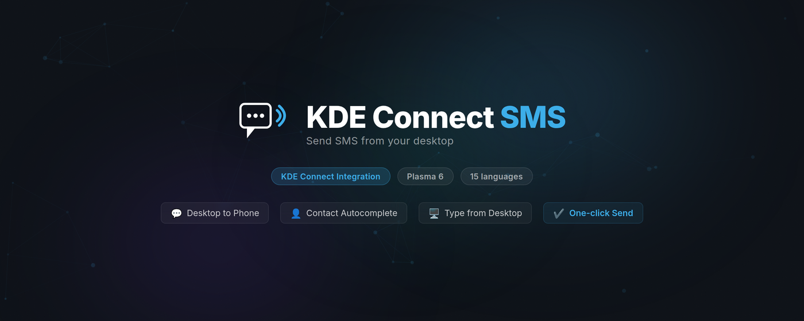

<p align="center">
  
</p>

<h1 align="center">KDE Connect SMS</h1>

<p align="center">
  A KDE Plasma 6 plasmoid to send SMS from your desktop via KDE Connect.
</p>

<p align="center">
  
  
</p>

## Features

- **Send SMS** — compose and send text messages from your KDE Plasma desktop
- **KDE Connect integration** — uses your paired Android phone as the SMS gateway
- **Contact autocomplete** — search contacts via KPeople integration
- **Phone number formatting** — automatic country detection and as-you-type formatting via libphonenumber-js
- **SMS history** — view sent message history per contact, full-page history view with back navigation
- **Unread notification badge** — dot indicator on the panel icon for unread messages
- **Configurable device** — select your KDE Connect paired device, multi-device support
- **Audible feedback** — optional beep sound after sending
- **15 languages** — fr, de, es, pt_BR, ru, zh_CN, ja, ko, it, nl, pl, tr, ar, uk, cs

## Requirements

- KDE Plasma 6
- [KDE Connect](https://kdeconnect.kde.org/) (desktop app + paired Android phone)
- `kpackagetool6`

## Installation

### From KDE Store (recommended)

1. Right-click your panel → **Add Widgets** → **Get New Widgets** → **Download New Plasma Widgets**
2. Search **"KDE Connect SMS"** → **Install**

Or visit [store.kde.org/p/1202579](https://store.kde.org/p/1202579).

### From .plasmoid file

```bash
kpackagetool6 -t Plasma/Applet -i com.comexpertise.plasma.kdeconnectsms-<version>.plasmoid
```

### From source

```bash
git clone https://github.com/comxd/plasma-kdeconnect-sms.git
cd plasma-kdeconnect-sms
kpackagetool6 -t Plasma/Applet -i .
```

Then right-click your panel → **Add Widgets** → search **"KDE Connect SMS"**.

### After updating

If the widget still shows the old UI after an update, restart Plasma shell:

```bash
systemctl --user restart plasma-plasmashell.service
```

Or log out and log back in.

## Building

```bash
bash scripts/build-plasmoid.sh
```

Produces `com.comexpertise.plasma.kdeconnectsms-<version>.plasmoid` ready for distribution.

## Development

### Translations

```bash
bash translate/merge.sh   # extract strings → update .po files
bash translate/build.sh   # compile .po → .mo
```

### VM Testing

```bash
export KDE_NEON_ISO=/path/to/neon-user-current.iso
./vm/launch-vm.sh --setup     # Fully automated VM setup
./vm/reload-plasmoid.sh       # Reload after code changes
```

## License

© 2026 ComExpertise — GPL-2.0-or-later — see individual file headers for details.

## Author

David DIVERRES — [ComExpertise](https://www.comexpertise.com)
